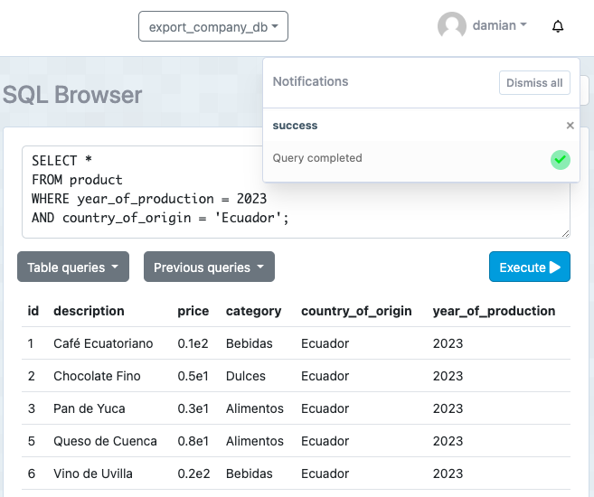
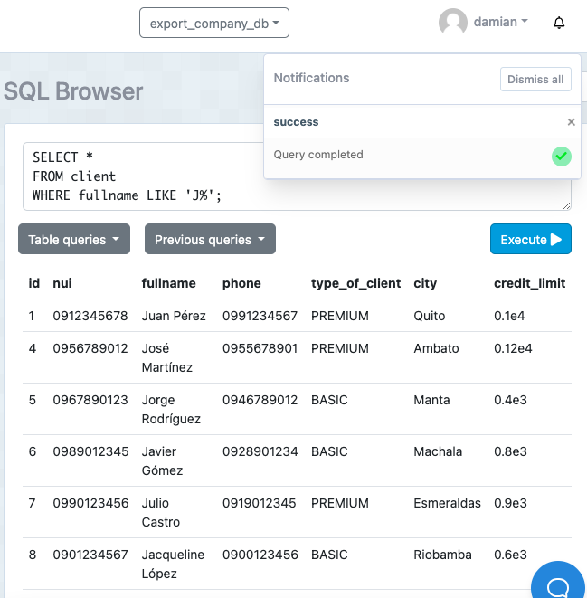

# TAS8 - Sentencias where multicriterio

Damian Olivo

## 1. Contar el número de productos de una categoría específica.

  - Sentencia:
  ```
  SELECT COUNT(*) 
  FROM product 
  WHERE category = 'Bebidas';
  ```
  - Captura:


## 2. Contar el número de clientes en una ciudad específica.
  - Sentencia:
  ```
  SELECT COUNT(*) 
  FROM client 
  WHERE city = 'Quito';
  ```
  - Captura:


## 3. Contar el número de productos cuyo precio está dentro de un rango específico.

  - Sentencia:
  ```
  SELECT COUNT(*) 
  FROM product 
  WHERE price BETWEEN 5.00 AND 15.00;
  ```
  - Captura:


## 4. Seleccionar clientes que viven en una ciudad específica y tienen un tipo de cliente específico.
  - Sentencia:
  ```
  SELECT * 
  FROM client 
  WHERE city = 'Quito' 
  AND type_of_client = 'PREMIUM';
  ```
  - Captura:


## 5. Seleccionar productos que pertenecen a una categoría específica y cuyo precio está por encima de un valor específico.
  - Sentencia:
  ```
  SELECT * 
  FROM product 
  WHERE category = 'Dulces' 
  AND price > 5.00;
  ```
  - Captura:


## 6. Seleccionar productos que fueron producidos en un año específico y en un país de origen específico.

  - Sentencia:
  ```
  SELECT * 
  FROM product 
  WHERE year_of_production = 2023 
  AND country_of_origin = 'Ecuador';
  ```
  - Captura:



## 7. Seleccionar clientes cuyo nombre completo comience con 'J'..
  - Sentencia:
  ```
  SELECT * 
  FROM client 
  WHERE fullname LIKE 'J%';
  ```
  - Captura:



## 8. Seleccionar clientes cuya ciudad contenga la letra 'a'.

  - Sentencia:
  ```
  SELECT * 
  FROM client 
  WHERE city LIKE '%a%';
  ```
  - Captura:


